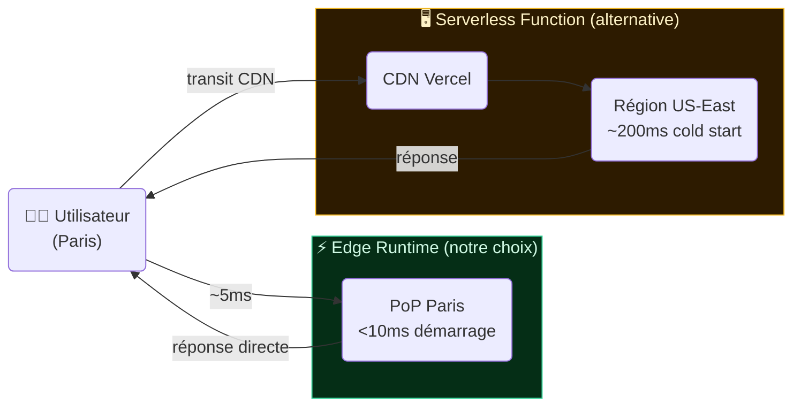
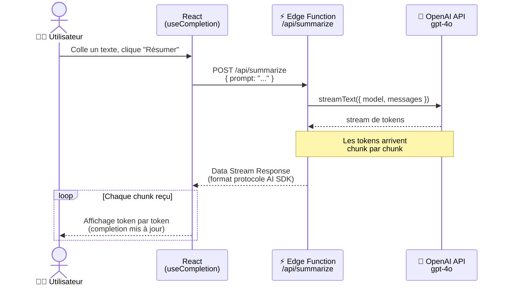
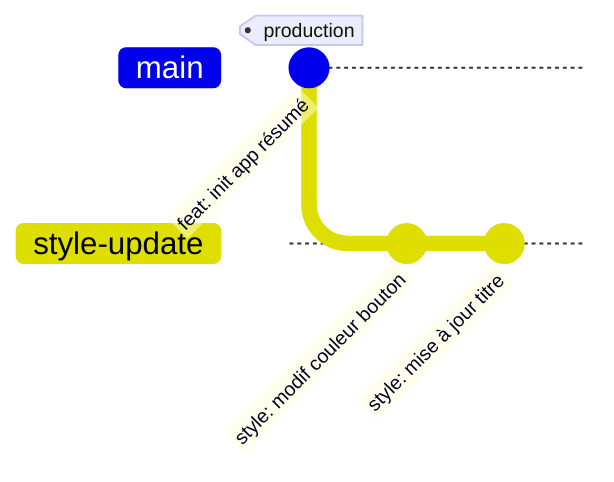

# Guide Complet de la Plateforme Vercel : Offre Technique, Tarification et Cas Pratique de Déploiement

## 1. Présentation de l'Offre Technique et de l'Architecture Vercel

Initialement reconnue comme la plateforme native de l'écosystème Next.js, Vercel s'est transformée pour devenir un environnement d'exécution global et une plateforme de développement full-stack assistée par IA. Elle prend en charge une large variété de frameworks frontend (React, Vue, Angular, Svelte, Astro, Nuxt) ainsi que des architectures de backend léger.

### 1.1 Infrastructures de Calcul : Serverless et Edge Network

- **Vercel Serverless Functions** : Exécution de code backend[¹] à la demande sans gestion de serveurs[²]. Idéal pour les API REST, GraphQL ou les traitements asynchrones. Supporte Node.js, Python, Go et Ruby. La plateforme utilise de nouvelles architectures d'optimisation (Fluid Compute) permettant de réduire les temps de latence au démarrage et d'ajuster dynamiquement les ressources allouées.
- **Vercel Edge Network & Edge Functions** : Déploiement de scripts légers directement sur le réseau mondial de diffusion de contenu (CDN[³]) de Vercel (qui compte plus de 126 points de présence (PoP[⁴]) mondiaux). S'exécutant sur un moteur basé sur V8[⁵], les Edge Functions éliminent les délais d'initialisation appelés *cold starts*[⁶] avec des démarrages en moins de 10ms. Elles sont incontournables pour les scénarios nécessitant du streaming[⁷] en temps réel ou des manipulations de requêtes à la volée au plus près de l'utilisateur.

**Schéma 1 — Comparaison Edge Runtime[⁸] vs Serverless Functions**



> **Points clés** : l'Edge Runtime s'exécute dans le PoP le plus proche de l'utilisateur (ici Paris), évitant le détour vers une région de datacenter fixe. C'est pourquoi ce TP utilise `export const runtime = 'edge'` dans la route API.

---

*Notes — Section 1*

[¹] **Backend** : partie d'une application qui s'exécute côté serveur, invisible de l'utilisateur. Elle traite la logique métier, accède aux bases de données et expose des API. S'oppose au *frontend*, qui s'exécute dans le navigateur.

[²] **Serverless** : modèle d'exécution où le développeur déploie du code sans provisionner ni gérer de serveurs. Le fournisseur alloue dynamiquement les ressources à la demande et facture à la consommation réelle plutôt qu'à la capacité réservée.

[³] **CDN (Content Delivery Network)** : réseau de serveurs répartis géographiquement qui cache et distribue les contenus statiques (images, JS, CSS) depuis le nœud le plus proche de l'utilisateur, réduisant la latence de livraison.

[⁴] **PoP (Point of Presence)** : nœud physique du réseau CDN ou Edge installé dans un datacenter régional. Plus un PoP est proche de l'utilisateur, plus la latence est faible. Vercel en compte 126+ dans le monde.

[⁵] **V8** : moteur JavaScript open-source développé par Google, utilisé dans Chrome et Node.js. L'Edge Runtime de Vercel s'appuie sur V8 (via Cloudflare Workers) plutôt que sur Node.js complet, ce qui réduit drastiquement la taille de l'environnement d'exécution et permet des démarrages quasi-instantanés.

[⁶] **Cold start** : délai d'initialisation d'une fonction serverless ou edge lorsqu'elle n'a pas été appelée récemment et que son environnement d'exécution a été désalloué. Peut varier de quelques dizaines de millisecondes (Edge) à plusieurs secondes (Serverless Node.js avec de grosses dépendances).

[⁷] **Streaming** : technique de transmission de données par laquelle les résultats sont envoyés au client au fur et à mesure qu'ils sont produits, sans attendre la fin du traitement complet. Dans le contexte des LLM, chaque token généré est transmis dès sa production.

[⁸] **Edge Runtime** : environnement d'exécution JavaScript allégé (basé sur V8, sans les APIs Node.js complètes) déployé directement sur les nœuds du CDN (PoP). Offre des démarrages < 10ms et une exécution au plus proche de l'utilisateur, au prix de restrictions : pas d'accès système de fichiers, pas de `fs`, bundle limité en taille.


### 1.2 Capacités IA et Révolution du Workflow avec v0

- **Vercel AI SDK** : Une bibliothèque TypeScript unifiée devenue un standard industriel pour connecter les applications web aux grands modèles de langage (OpenAI, Anthropic, Google Gemini, Mistral, etc.). Elle fournit une gestion native du streaming de jetons (tokens[⁹]) et intègre l'appel d'outils (Tool Use) de façon transparente avec l'Edge Runtime pour des interfaces réactives.
- **v0 by Vercel** : Un environnement de développement assisté par IA qui permet de générer des interfaces utilisateur interactives et des applications full-stack à partir de descriptions en langage naturel. v0 inclut désormais un bac à sable (sandbox) d'exécution qui simule la production, intègre les API Next.js, et gère automatiquement la synchronisation avec GitHub sous forme de Pull Requests[¹⁰].

### 1.3 Observabilité, Performances et Sécurité

- **Speed Insights & Web Analytics** : Outils de télémétrie intégrés permettant de mesurer l'expérience réelle des utilisateurs à l'aide des Core Web Vitals[¹¹] (notamment le score d'Interaction to Next Paint — INP[¹²]).
- **Edge Firewall** : Un pare-feu actif par défaut en périphérie de réseau qui protège de manière autonome contre les attaques DDoS, gère les listes de blocage d'IP et sécurise l'infrastructure multilocataire.

---

*Notes — Section 1.2 & 1.3*

[⁹] **Token** : unité de traitement des LLM. Un token correspond approximativement à ¾ de mot en anglais (environ 4 caractères). Les modèles ne lisent et ne génèrent pas des mots mais des tokens ; leur coût et leurs limites de contexte sont exprimés en tokens.

[¹⁰] **Pull Request (PR)** : mécanisme GitHub (et GitLab, Bitbucket…) permettant de proposer l'intégration d'une branche de code dans une autre (généralement `main`). La PR ouvre un espace de revue : commentaires, suggestions, vérifications automatisées (CI), avant le merge.

[¹¹] **Core Web Vitals** : ensemble de métriques définis par Google pour mesurer l'expérience utilisateur réelle d'une page web : LCP (temps de chargement du contenu principal), CLS (stabilité visuelle) et INP (réactivité aux interactions).

[¹²] **INP (Interaction to Next Paint)** : métrique Core Web Vital mesurant le délai entre une interaction utilisateur (clic, frappe) et la mise à jour visuelle correspondante de la page. Remplace le FID depuis mars 2024. Un bon INP est inférieur à 200ms.


## 2. Modèle de Tarification et Gestion des Coûts

La structure tarifaire de Vercel repose sur un modèle hybride combinant un abonnement par utilisateur (« siège ») et une facturation basée sur la consommation réelle des ressources réseau et de calcul. Une surveillance attentive de la consommation est indispensable pour éviter des surprises de facturation sur les applications à fort trafic.

| Composant / Plan         | Hobby (Gratuit)                                         | Pro                                                                           | Enterprise                                             |
|--------------------------|---------------------------------------------------------|-------------------------------------------------------------------------------|--------------------------------------------------------|
| **Usage ciblé**          | Projets personnels, apprentissage, prototypage.         | Équipes produit professionnelles, agences, applications commerciales.         | Grandes organisations exigeant gouvernance et volumes. |
| **Coût fixe de base**    | 0 $/mois                                               | 20 $/siège/mois (annuel) ou 24 $/mois. Inclut 20 $ de crédit infrastructure. | Tarification personnalisée sur contrat.                |
| **Bande passante**       | 100 GB/mois                                            | 1 TB inclus. Dépassement : ~40 $/100 GB.                                      | Sur mesure, quotas négociés.                           |
| **Exécution Serverless** | 100 GB-heures[¹³]/mois. Durée max : 5 min.                | 1 TB-heures/mois. Extensible jusqu'à 30 min.                                  | Capacités étendues et isolées.                         |
| **Build**                | 600 min/mois. 4 vCPUs, 8 GB RAM.                      | 6 000 min/mois. Turbo : 30 vCPUs, 60 GB RAM.                                 | Builds ultra-prioritaires, pipelines configurables.    |
| **Options & Sécurité**   | Analytics basique (50 000 événements).                 | SSO SAML[¹⁴] (300 $/mois), HIPAA BAA (350 $/mois), Observability Plus.           | SSO inclus, SLA dédié.                                 |

> **📝 Questions de compréhension — Section 2**
>
> 1. Votre application de résumé est hébergée sur le plan Hobby. Elle génère 150 GB de bande passante en un mois suite à un pic de trafic. Que se passe-t-il ? Quel plan aurait évité ce problème ?
> 2. Un client vous demande de déployer une application nécessitant une authentification SSO via SAML pour ses 5 000 employés. Quel plan recommandez-vous, et quel en est le coût mensuel minimum ?
> 3. Votre Edge Function de résumé traite en moyenne 2 secondes de calcul par requête. Sur le plan Hobby, combien de requêtes pouvez-vous traiter par mois avant d'atteindre la limite des 100 GB-heures ? *(indice : 1 GB-heure = 3 600 secondes de calcul pour 1 GB de RAM alloué)*

---

*Notes — Section 2*

[¹³] **GB-heure** : unité de facturation serverless combinant la mémoire allouée et la durée d'exécution. 1 GB-heure = 1 Go de RAM utilisé pendant 1 heure, soit 3 600 secondes de calcul à 1 Go, ou 1 800 secondes à 2 Go, etc.

[¹⁴] **SSO SAML (Single Sign-On / Security Assertion Markup Language)** : protocole d'authentification fédérée permettant à un utilisateur de se connecter une seule fois à un fournisseur d'identité (ex. Azure AD, Okta) pour accéder à plusieurs applications sans ressaisir ses identifiants. Standard incontournable en entreprise.

[¹⁵] **SLA (Service Level Agreement)** : contrat de niveau de service définissant les engagements du fournisseur en matière de disponibilité (ex. 99,99% d'uptime), de temps de réponse aux incidents, et les pénalités en cas de non-respect.


## 3. Cas Pratique : Déploiement d'une Application Full-Stack IA avec Next.js

**Objectif** : Développer localement, puis déployer sur Vercel une application web permettant de résumer du texte en temps réel via l'API d'un grand modèle de langage. L'architecture exploitera le framework Next.js, le Vercel AI SDK et l'Edge Runtime de Vercel pour garantir un temps d'attente minimal au premier octet (TTFB[¹⁶]).

**Prérequis** : Node.js ≥ 18, npm, Git, un compte GitHub, un compte Vercel (Hobby gratuit suffit), et une clé API d'un fournisseur LLM (voir section ci-dessous).

---

### Choix du fournisseur LLM : options gratuites pour le TP

Le code présenté utilise OpenAI par défaut, mais **OpenAI ne propose plus de tier gratuit en 2026** : l'accès à l'API requiert un moyen de paiement. Trois alternatives permettent de réaliser ce TP sans carte bancaire. Elles sont toutes supportées nativement par le Vercel AI SDK via un package dédié, et l'adaptation du code se limite à changer deux lignes.

| Fournisseur | Modèle gratuit recommandé | Limite free tier | Carte requise |
|---|---|---|---|
| **Google Gemini** *(recommandé)* | `gemini-2.0-flash` | 1 500 req/jour, 1M tokens/min | Non |
| **Groq** | `llama-3.3-70b-versatile` | ~100K tokens/jour | Non |
| **OpenRouter** | modèles open-source rotatifs | 50 req/jour (gratuit) | Non |

#### Option 1 — Google Gemini (recommandé pour ce TP)

Google Gemini offre le free tier le plus généreux en 2026 : accès à Gemini 2.0 Flash avec 1 500 requêtes par jour et une fenêtre de contexte de 1 million de tokens, sans carte bancaire. C'est l'option la plus adaptée à un TP en groupe.

**Inscription** : [aistudio.google.com](https://aistudio.google.com) → *Get API key*. La clé s'appelle `GOOGLE_GENERATIVE_AI_API_KEY`.

```bash
npm install ai @ai-sdk/google
```

Adaptations dans `app/api/summarize/route.ts` :

```typescript
import { streamText } from 'ai';
import { google } from '@ai-sdk/google';  // ← remplace @ai-sdk/openai

export const runtime = 'edge';

export async function POST(req: Request) {
  const { prompt } = await req.json();

  const result = await streamText({
    model: google('gemini-2.0-flash'),    // ← remplace openai('gpt-4o')
    messages: [
      {
        role: 'system',
        content: 'Tu es un assistant expert. Résume le texte suivant de manière concise sous forme de puces.',
      },
      { role: 'user', content: prompt },
    ],
  });

  return result.toDataStreamResponse();
}
```

Variable d'environnement à configurer (localement dans `.env.local`, et dans Vercel à l'étape 4) :

```
GOOGLE_GENERATIVE_AI_API_KEY=your_key_here
```

#### Option 2 — Groq

Groq utilise des puces LPU[¹⁷] (Language Processing Unit) propriétaires et délivre l'inférence la plus rapide disponible gratuitement : latence au premier token inférieure à 200ms et débit de 500+ tokens/seconde. Son free tier est plus limité en volume mais la vitesse est un atout pédagogique pour visualiser le streaming.

**Inscription** : [console.groq.com](https://console.groq.com) → *API Keys*. La clé s'appelle `GROQ_API_KEY`.

Le provider Groq dispose d'un package officiel `@ai-sdk/groq` et utilise `GROQ_API_KEY` comme variable d'environnement par défaut.

```bash
npm install ai @ai-sdk/groq
```

```typescript
import { streamText } from 'ai';
import { groq } from '@ai-sdk/groq';     // ← remplace @ai-sdk/openai

export const runtime = 'edge';

export async function POST(req: Request) {
  const { prompt } = await req.json();

  const result = await streamText({
    model: groq('llama-3.3-70b-versatile'), // ← remplace openai('gpt-4o')
    messages: [
      {
        role: 'system',
        content: 'Tu es un assistant expert. Résume le texte suivant de manière concise sous forme de puces.',
      },
      { role: 'user', content: prompt },
    ],
  });

  return result.toDataStreamResponse();
}
```

Variable d'environnement :

```
GROQ_API_KEY=your_key_here
```

#### Option 3 — OpenRouter

OpenRouter agrège des centaines de modèles sous une API unique compatible OpenAI. Son free tier donne accès à une vingtaine de modèles open-source (Llama, Mistral, Gemma, DeepSeek) avec environ 200 requêtes par jour par modèle. C'est l'option la plus flexible si l'on veut comparer plusieurs modèles sans changer de fournisseur.

**Inscription** : [openrouter.ai](https://openrouter.ai) → *Keys*. La clé s'appelle `OPENROUTER_API_KEY`.

OpenRouter expose une API compatible OpenAI : on réutilise `@ai-sdk/openai` en surchargeant la `baseURL`.

```bash
npm install ai @ai-sdk/openai
```

```typescript
import { streamText } from 'ai';
import { createOpenAI } from '@ai-sdk/openai';

const openrouter = createOpenAI({
  baseURL: 'https://openrouter.ai/api/v1',
  apiKey: process.env.OPENROUTER_API_KEY,
});

export const runtime = 'edge';

export async function POST(req: Request) {
  const { prompt } = await req.json();

  const result = await streamText({
    model: openrouter('meta-llama/llama-3.3-70b-instruct:free'), // suffixe :free = modèle gratuit
    messages: [
      {
        role: 'system',
        content: 'Tu es un assistant expert. Résume le texte suivant de manière concise sous forme de puces.',
      },
      { role: 'user', content: prompt },
    ],
  });

  return result.toDataStreamResponse();
}
```

Variable d'environnement :

```
OPENROUTER_API_KEY=your_key_here
```

> **💡 Ce que ce choix illustre**
> La grande force du Vercel AI SDK est précisément cette interchangeabilité : changer de fournisseur ne modifie que l'import et le nom du modèle. La route API, le hook `useCompletion` côté client, et le reste de l'architecture restent strictement identiques quelle que soit l'option choisie.

---

**Schéma 2 — Architecture globale du flux de données en streaming**



> **Pourquoi le streaming ?** Sans streaming, l'utilisateur attend que le modèle génère l'intégralité de la réponse avant de voir quoi que ce soit. Avec le streaming, les premiers mots s'affichent en moins d'une seconde, ce qui améliore considérablement l'expérience perçue.

---

*Notes — Introduction du TP*

[¹⁶] **TTFB (Time To First Byte)** : métrique mesurant le délai entre l'envoi d'une requête HTTP par le client et la réception du premier octet de la réponse du serveur. Dans le contexte du streaming LLM, c'est le délai avant l'apparition du premier token à l'écran — l'indicateur clé de la réactivité perçue.

[¹⁷] **LPU (Language Processing Unit)** : puce matérielle propriétaire de Groq, conçue spécifiquement pour l'inférence de modèles de langage. Contrairement aux GPU généralistes, les LPU sont optimisées pour le traitement séquentiel des tokens, ce qui explique leur débit exceptionnel (500+ tokens/seconde).


### Étape 1 : Initialisation du projet local

Ouvrez votre terminal et initialisez un nouveau projet Next.js :

```bash
npx create-next-app@latest vercel-ai-summary --typescript --tailwind --app
cd vercel-ai-summary
```

Installez le Vercel AI SDK et le fournisseur de modèle :

```bash
npm install ai @ai-sdk/openai
```

> **✅ Vérification — Étape 1**
>
> Lancez `npm run dev` et ouvrez `http://localhost:3000`. Vous devez voir la page d'accueil Next.js par défaut. Si vous obtenez une erreur, vérifiez que votre version de Node.js est bien ≥ 18 avec `node --version`.
>
> *Questions :*
> 1. Quels dossiers et fichiers principaux l'App Router[¹⁸] de Next.js a-t-il générés ? À quoi sert le dossier `app/` par rapport à l'ancien dossier `pages/` ?
> 2. Pourquoi installe-t-on `@ai-sdk/openai` séparément du package `ai` ? Que se passerait-il si l'on voulait utiliser Google Gemini à la place ?

---

*Notes — Étape 1*

[¹⁸] **App Router** : système de routage introduit dans Next.js 13, basé sur la structure de dossiers dans `app/`. Chaque dossier correspond à un segment d'URL ; les fichiers `page.tsx`, `layout.tsx`, `route.ts` ont des rôles conventionnels. Il remplace progressivement le `pages/` Router de Next.js 12 et antérieurs, en apportant les React Server Components, le streaming natif et les layouts imbriqués.


### Étape 2 : Création de la Route d'API en Edge Runtime

Créez le fichier `app/api/summarize/route.ts`. L'utilisation explicite de l'Edge Runtime permet un démarrage ultra-rapide (< 10ms) sans cold start.

```typescript
import { streamText } from 'ai';
import { openai } from '@ai-sdk/openai';

// Activation explicite de l'Edge Runtime de Vercel
export const runtime = 'edge';

export async function POST(req: Request) {
  const { prompt } = await req.json();

  const result = await streamText({
    model: openai('gpt-4o'),
    messages: [
      {
        role: 'system',
        content: 'Tu es un assistant expert. Résume le texte suivant de manière concise sous forme de puces.',
      },
      { role: 'user', content: prompt },
    ],
  });

  return result.toDataStreamResponse();
}
```

> **Note** : le champ attendu est `prompt` (et non `text`), car c'est le nom qu'envoie par défaut le hook `useCompletion` utilisé côté frontend.

> **🔒 Sécurité — Pourquoi la clé reste côté serveur**
>
> La route `/api/summarize` joue un rôle de **proxy sécurisé** entre le navigateur et le fournisseur LLM. C'est un point d'architecture critique à bien comprendre.
>
> Dans Next.js, toute variable d'environnement **sans** le préfixe `NEXT_PUBLIC_` n'est accessible que côté serveur (Edge Function ou Serverless Function). Elle n'est jamais incluse dans le bundle[¹⁹] JavaScript envoyé au navigateur. Ainsi `GOOGLE_GENERATIVE_AI_API_KEY`, `GROQ_API_KEY` ou `OPENAI_API_KEY` restent invisibles pour quiconque inspecte les sources de la page.
>
> À l'inverse, si un étudiant appelle l'API du fournisseur **directement depuis `page.tsx`** pour simplifier, il serait tenté d'écrire :
>
> ```typescript
> // ❌ NE JAMAIS FAIRE — la clé sera visible dans les DevTools
> const apiKey = 'sk-...';
> ```
>
> ou pire, d'utiliser une variable `NEXT_PUBLIC_MY_API_KEY` pour la rendre accessible côté client. Dans les deux cas, la clé est exposée en clair dans le JavaScript servi au navigateur, récupérable en quelques secondes par n'importe quel visiteur.
>
> **Protection complémentaire : limiter la taille du prompt**
>
> Sans garde-fou, n'importe qui connaissant l'URL de production peut appeler `/api/summarize` en boucle avec des prompts géants et épuiser le quota gratuit du fournisseur en quelques minutes. Ajoutez cette vérification en tête de la fonction `POST` :
>
> ```typescript
> export async function POST(req: Request) {
>   const { prompt } = await req.json();
>
>   // 🔒 Limite la taille du prompt à 5 000 caractères
>   if (!prompt || typeof prompt !== 'string' || prompt.length > 5000) {
>     return new Response(
>       JSON.stringify({ error: 'Prompt invalide ou trop long (max 5 000 caractères).' }),
>       { status: 400, headers: { 'Content-Type': 'application/json' } }
>     );
>   }
>
>   // … suite du code inchangée
> }
> ```
>
> Cette validation côté serveur est indispensable : une validation uniquement côté client (dans le formulaire React) peut être contournée trivialement avec `curl`.

> **✅ Vérification — Étape 2**
>
> Testez votre route directement depuis le terminal avec `curl` (remplacez la clé par la vôtre) :
>
> ```bash
> curl -X POST http://localhost:3000/api/summarize \
>   -H "Content-Type: application/json" \
>   -d '{"prompt": "La photosynthèse est le processus par lequel les plantes convertissent la lumière en énergie."}' \
>   --no-buffer
> ```
>
> Vous devez voir des chunks de texte s'afficher progressivement dans le terminal, préfixés par `0:`.
>
> *Questions :*
> 1. Que signifient les préfixes `0:`, `e:`, `d:` dans la réponse brute ? Pourquoi ne peut-on pas afficher ce texte directement dans l'interface sans passer par le SDK ?
> 2. Que se passe-t-il si vous supprimez `export const runtime = 'edge'` ? La route fonctionne-t-elle toujours ? Observez-vous une différence de comportement ou de latence en développement local ?
> 3. Où est lue la variable d'environnement `OPENAI_API_KEY` dans ce code ? Pourquoi n'apparaît-elle nulle part explicitement ?

---

*Notes — Étape 2*

[¹⁹] **Bundle** : fichier JavaScript produit par le compilateur (ici Next.js / Webpack/Turbopack) qui regroupe et minifie le code source et ses dépendances pour livraison au navigateur ou à l'environnement d'exécution. L'Edge Runtime impose une limite de taille de bundle (typiquement 1–4 Mo compressé) pour garantir des démarrages rapides.


### Étape 3 : Développement de l'Interface Utilisateur (Frontend)

Modifiez `app/page.tsx`. Le hook `useCompletion` du SDK gère intégralement le protocole Data Stream[²⁰] — il accumule les chunks dans `completion` et expose `isLoading` et `error` sans qu'on ait à manipuler `ReadableStream` manuellement.

```tsx
'use client';

import { useCompletion } from 'ai/react';

export default function SummaryPage() {
  const {
    completion,        // texte streamé accumulé
    input,             // valeur du textarea
    handleInputChange,
    handleSubmit,
    isLoading,
    error,
  } = useCompletion({
    api: '/api/summarize',
  });

  return (
    <main className="p-8 max-w-2xl mx-auto font-sans">
      <h1 className="text-2xl font-bold mb-4">
        Optimiseur de Lecture – Résumé par IA
      </h1>

      <form onSubmit={handleSubmit}>
        <textarea
          className="w-full h-40 p-3 border rounded mb-4 text-black"
          placeholder="Collez votre long texte ici..."
          value={input}
          onChange={handleInputChange}
        />
        <button
          type="submit"
          disabled={isLoading || !input}
          className="px-4 py-2 bg-black text-white rounded hover:bg-gray-800 disabled:bg-gray-400"
        >
          {isLoading ? 'Analyse en cours...' : 'Résumer le texte'}
        </button>
      </form>

      {/* Erreur affichée à l'utilisateur */}
      {error && (
        <div className="mt-4 p-3 bg-red-50 border border-red-200 rounded text-red-700">
          Une erreur est survenue : {error.message}
        </div>
      )}

      {/* Résumé streamé */}
      {completion && (
        <div className="mt-6 p-4 bg-gray-50 border rounded">
          <h2 className="font-semibold mb-2">Résumé généré en streaming :</h2>
          <p className="whitespace-pre-line text-gray-800">{completion}</p>
        </div>
      )}
    </main>
  );
}
```

> **✅ Vérification — Étape 3**
>
> Rechargez `http://localhost:3000`, collez un paragraphe de texte et cliquez sur « Résumer ». Vous devez voir le résumé apparaître mot par mot sans rechargement de page.
>
> Ouvrez les DevTools (onglet **Network**), filtrez sur `Fetch/XHR` et observez la requête vers `/api/summarize` : son type doit être `text/event-stream` et la colonne *Time* doit rester ouverte pendant toute la durée du streaming.
>
> *Questions :*
> 1. Pourquoi le fichier commence-t-il par la directive `'use client'`[²¹] ? Que se passerait-il si on l'omettait ?
> 2. Le hook `useCompletion` gère l'état `isLoading` automatiquement. À quel moment précis passe-t-il à `true`, puis à `false` ?
> 3. **Défi** : modifiez le composant pour afficher le nombre de mots du résumé généré, mis à jour en temps réel au fil du streaming.

---

*Notes — Étape 3*

[²⁰] **Data Stream Protocol** : protocole de communication propre au Vercel AI SDK, transmis en `text/event-stream`. Chaque chunk est préfixé d'un code de type (`0:` pour un token texte, `e:` pour la fin du stream, `d:` pour les métadonnées). Ce format structuré permet à `useCompletion` de reconstituer proprement la réponse côté client.

[²¹] **`'use client'`** : directive Next.js (App Router) placée en première ligne d'un fichier pour indiquer que le composant doit s'exécuter dans le navigateur (client). Sans elle, Next.js traite le fichier comme un React Server Component, exécuté côté serveur — incompatible avec les hooks React (`useState`, `useEffect`, `useCompletion`…) qui nécessitent un environnement navigateur.


### Étape 4 : Robustesse — Gestion complète des erreurs

Une application qui fonctionne dans le cas nominal mais plante silencieusement sur tous les cas d'erreur n'est pas prête à être déployée. Cette étape ajoute une gestion des erreurs à deux niveaux : côté serveur dans la route API, et côté client dans l'interface.

#### 4.1 Route API — `app/api/summarize/route.ts`

Trois problèmes à adresser : la validation incomplète de l'entrée, l'absence de gestion des erreurs du fournisseur LLM, et l'absence de timeout.

```typescript
import { streamText } from 'ai';
import { google } from '@ai-sdk/google';

export const runtime = 'edge';

// Codes d'erreur métier explicites, réutilisables côté client
const ERROR_CODES = {
  PROMPT_MISSING:  { status: 400, code: 'PROMPT_MISSING',  message: 'Le prompt est manquant ou invalide.' },
  PROMPT_EMPTY:    { status: 400, code: 'PROMPT_EMPTY',    message: 'Le prompt ne peut pas être vide.' },
  PROMPT_TOO_LONG: { status: 400, code: 'PROMPT_TOO_LONG', message: 'Le prompt dépasse 5 000 caractères.' },
  QUOTA_EXCEEDED:  { status: 429, code: 'QUOTA_EXCEEDED',  message: 'Quota du fournisseur LLM épuisé. Réessayez plus tard.' },
  PROVIDER_ERROR:  { status: 502, code: 'PROVIDER_ERROR',  message: 'Le fournisseur LLM est temporairement indisponible.' },
  TIMEOUT:         { status: 504, code: 'TIMEOUT',         message: 'La génération a pris trop de temps. Réessayez.' },
  INTERNAL_ERROR:  { status: 500, code: 'INTERNAL_ERROR',  message: 'Erreur interne du serveur.' },
} as const;

function errorResponse(err: typeof ERROR_CODES[keyof typeof ERROR_CODES]) {
  return new Response(JSON.stringify({ error: err.code, message: err.message }), {
    status: err.status,
    headers: { 'Content-Type': 'application/json' },
  });
}

export async function POST(req: Request) {
  // 1. Validation de l'entrée
  let prompt: string;
  try {
    const body = await req.json();
    prompt = body?.prompt;
  } catch {
    return errorResponse(ERROR_CODES.PROMPT_MISSING);
  }

  if (typeof prompt !== 'string') return errorResponse(ERROR_CODES.PROMPT_MISSING);
  if (prompt.trim().length === 0)  return errorResponse(ERROR_CODES.PROMPT_EMPTY);
  if (prompt.length > 5000)        return errorResponse(ERROR_CODES.PROMPT_TOO_LONG);

  // 2. Timeout[²²] : coupe la requête LLM après 25 secondes
  const controller = new AbortController();
  const timeoutId = setTimeout(() => controller.abort(), 25_000);

  try {
    const result = await streamText({
      model: google('gemini-2.0-flash'),
      messages: [
        {
          role: 'system',
          content: 'Tu es un assistant expert. Résume le texte suivant de manière concise sous forme de puces.',
        },
        { role: 'user', content: prompt.trim() },
      ],
      abortSignal: controller.signal,  // 3. Signal de timeout transmis au SDK
    });

    clearTimeout(timeoutId);
    return result.toDataStreamResponse();

  } catch (err: unknown) {
    clearTimeout(timeoutId);

    // 4. Distinguer les types d'erreurs du fournisseur
    if (err instanceof Error) {
      if (err.name === 'AbortError') {
        return errorResponse(ERROR_CODES.TIMEOUT);
      }
      // Les erreurs 429 des fournisseurs (quota dépassé)
      if (err.message.includes('429') || err.message.toLowerCase().includes('quota')) {
        return errorResponse(ERROR_CODES.QUOTA_EXCEEDED);
      }
      // Autres erreurs de communication avec le fournisseur
      if (err.message.includes('fetch') || err.message.includes('network')) {
        return errorResponse(ERROR_CODES.PROVIDER_ERROR);
      }
    }

    return errorResponse(ERROR_CODES.INTERNAL_ERROR);
  }
}
```

#### 4.2 Interface — `app/page.tsx`

Côté client, quatre améliorations : distinction des types d'erreurs par code HTTP, détection du streaming interrompu à mi-chemin, états visuels distincts (vide / chargement / erreur / résultat), et bouton de nouvelle tentative.

```tsx
'use client';

import { useState, useEffect, useRef } from 'react';
import { useCompletion } from 'ai/react';

// Message utilisateur selon le code d'erreur renvoyé par la route
function getUserMessage(err: Error): { title: string; detail: string; retryable: boolean } {
  // useCompletion expose le status HTTP dans err.message sous la forme "... NNN ..."
  const status = parseInt(err.message.match(/\b(\d{3})\b/)?.[1] ?? '0');
  try {
    // Si la route a renvoyé un JSON avec un code métier
    const body = JSON.parse(err.message.slice(err.message.indexOf('{')));
    if (body.code === 'PROMPT_TOO_LONG')
      return { title: 'Texte trop long', detail: 'Limitez votre texte à 5 000 caractères.', retryable: false };
    if (body.code === 'PROMPT_EMPTY')
      return { title: 'Texte vide', detail: 'Collez un texte avant de résumer.', retryable: false };
    if (body.code === 'QUOTA_EXCEEDED')
      return { title: 'Quota épuisé', detail: 'Le service est temporairement limité. Réessayez dans quelques minutes.', retryable: true };
    if (body.code === 'TIMEOUT')
      return { title: 'Délai dépassé', detail: 'La génération a pris trop de temps. Réessayez avec un texte plus court.', retryable: true };
  } catch { /* pas de JSON dans l'erreur */ }

  if (status === 429)
    return { title: 'Quota épuisé', detail: 'Réessayez dans quelques minutes.', retryable: true };
  if (status >= 500)
    return { title: 'Erreur serveur', detail: 'Le service est temporairement indisponible.', retryable: true };

  return { title: 'Erreur inattendue', detail: err.message, retryable: true };
}

export default function SummaryPage() {
  const {
    completion,
    input,
    handleInputChange,
    handleSubmit,
    isLoading,
    error,
    complete,   // permet de resoumettre le même prompt
  } = useCompletion({ api: '/api/summarize' });

  // Détection du streaming interrompu : isLoading passe à false
  // mais completion est vide alors qu'une génération était en cours
  const wasLoadingRef = useRef(false);
  const [streamInterrupted, setStreamInterrupted] = useState(false);

  useEffect(() => {
    if (wasLoadingRef.current && !isLoading && !error && completion === '') {
      setStreamInterrupted(true);
    }
    if (isLoading) setStreamInterrupted(false);
    wasLoadingRef.current = isLoading;
  }, [isLoading, error, completion]);

  const errorInfo = error ? getUserMessage(error) : null;

  return (
    <main className="p-8 max-w-2xl mx-auto font-sans">
      <h1 className="text-2xl font-bold mb-4">Optimiseur de Lecture – Résumé par IA</h1>

      <form onSubmit={handleSubmit}>
        <textarea
          className="w-full h-40 p-3 border rounded mb-1 text-black"
          placeholder="Collez votre long texte ici..."
          value={input}
          onChange={handleInputChange}
          maxLength={5000}
        />
        {/* Compteur de caractères */}
        <div className="text-right text-xs text-gray-400 mb-3">
          {input.length} / 5 000 caractères
        </div>

        <button
          type="submit"
          disabled={isLoading || !input.trim()}
          className="px-4 py-2 bg-black text-white rounded hover:bg-gray-800 disabled:bg-gray-400"
        >
          {isLoading ? 'Analyse en cours…' : 'Résumer le texte'}
        </button>
      </form>

      {/* Erreur typée avec bouton de nouvelle tentative */}
      {errorInfo && (
        <div className="mt-4 p-4 bg-red-50 border border-red-200 rounded">
          <p className="font-semibold text-red-700">{errorInfo.title}</p>
          <p className="text-sm text-red-600 mt-1">{errorInfo.detail}</p>
          {errorInfo.retryable && (
            <button
              onClick={() => complete(input)}
              className="mt-3 px-3 py-1 text-sm bg-red-100 text-red-700 rounded hover:bg-red-200"
            >
              Réessayer
            </button>
          )}
        </div>
      )}

      {/* Streaming interrompu à mi-chemin */}
      {streamInterrupted && !error && (
        <div className="mt-4 p-4 bg-amber-50 border border-amber-200 rounded">
          <p className="font-semibold text-amber-700">Connexion interrompue</p>
          <p className="text-sm text-amber-600 mt-1">
            Le streaming s'est arrêté avant la fin. Vérifiez votre connexion.
          </p>
          <button
            onClick={() => complete(input)}
            className="mt-3 px-3 py-1 text-sm bg-amber-100 text-amber-700 rounded hover:bg-amber-200"
          >
            Réessayer
          </button>
        </div>
      )}

      {/* Résumé streamé */}
      {completion && (
        <div className="mt-6 p-4 bg-gray-50 border rounded">
          <h2 className="font-semibold mb-2">Résumé généré en streaming :</h2>
          <p className="whitespace-pre-line text-gray-800">{completion}</p>
        </div>
      )}

      {/* État vide explicite — après une soumission sans résultat */}
      {!isLoading && !completion && !error && !streamInterrupted && input && (
        <p className="mt-4 text-sm text-gray-400 italic">
          Aucun résumé généré pour l'instant.
        </p>
      )}
    </main>
  );
}
```

> **✅ Vérification — Étape 4**
>
> Testez chaque cas d'erreur un par un :
>
> 1. **Prompt vide** : soumettez un texte composé uniquement d'espaces. Le bouton doit rester désactivé (`input.trim()` est vide).
> 2. **Prompt trop long** : envoyez via `curl` un prompt de plus de 5 000 caractères. Vérifiez que la route retourne un `400` avec `"code": "PROMPT_TOO_LONG"`, et que l'interface affiche "Texte trop long" sans bouton de nouvelle tentative (l'erreur n'est pas retryable).
> 3. **Clé API invalide** : remplacez temporairement la valeur de votre variable d'environnement par `INVALID_KEY` dans `.env.local`, relancez le serveur, et soumettez. Vérifiez que la route retourne un `502` et que l'interface affiche "Erreur serveur" avec un bouton "Réessayer".
> 4. **Streaming interrompu** : démarrez une génération, coupez votre connexion réseau (mode avion) pendant le streaming, puis rétablissez-la. L'avertissement "Connexion interrompue" doit apparaître.
>
> *Questions :*
> 1. Pourquoi valide-t-on `prompt.trim().length === 0` côté serveur alors que le bouton est déjà désactivé côté client si le champ est vide ? Donnez un exemple concret de situation où la validation client serait contournée.
> 2. Quelle est la différence entre un timeout côté serveur (via `AbortController`) et un timeout côté client (couper la connexion) ? Lequel protège le quota du fournisseur LLM ?
> 3. Pourquoi l'erreur "quota épuisé" est-elle `retryable: true` alors que réessayer immédiatement ne fonctionnera probablement pas ? Quel serait un comportement encore plus robuste ?

---

*Notes — Étape 4*

[²²] **Timeout / AbortController** : mécanisme JavaScript permettant d'annuler une opération asynchrone (fetch, stream…) après un délai défini. `AbortController` expose un `signal` transmis à la requête ; quand `controller.abort()` est appelé, la requête est interrompue et une `AbortError` est levée. Côté serveur, cela libère les ressources et évite de consommer inutilement le quota du fournisseur LLM.

[²³] **Webhook** : mécanisme par lequel un service externe (ici GitHub) notifie automatiquement un autre service (ici Vercel) d'un événement via une requête HTTP POST. Quand une PR est ouverte sur GitHub, un webhook déclenche immédiatement un build de prévisualisation sur Vercel, sans intervention manuelle.


### Étape 5 : Publication sur GitHub et Liaison avec Vercel


1. Initialisez votre dépôt Git local (`git init`), ajoutez vos fichiers (`git add .`) et effectuez votre premier commit (`git commit -m "feat: initialisation de l'application de résumé"`).
2. Créez un dépôt sur GitHub (public ou privé) et poussez votre code vers la branche principale (`main`).
3. Rendez-vous sur le tableau de bord Vercel. Cliquez sur **"Add New…"** puis **"Project"**.
4. Sélectionnez le fournisseur GitHub, autorisez l'accès, puis cliquez sur **"Import"** en face du dépôt `vercel-ai-summary`.
5. Dans l'onglet **"Environment Variables"**, ajoutez la variable de clé API avec votre valeur. ⚠️ Ne commitez jamais une clé API dans votre code ou dans un fichier `.env` versionné.
6. Cliquez sur **"Deploy"**. Vercel détecte automatiquement la structure Next.js, provisionne les Turbo build machines, configure les routes Edge et génère l'URL publique de production en quelques secondes.

> **🔒 Sécurité — Bonnes pratiques de gestion des secrets sur Vercel**
>
> **1. Restreindre la clé côté fournisseur**
>
> Avant de saisir votre clé dans Vercel, vérifiez que votre fournisseur permet de la restreindre :
> - **Google AI Studio** → *API keys* → vous pouvez restreindre la clé à une liste de domaines autorisés (ajoutez `*.vercel.app` et votre domaine de production).
> - **Groq** → les clés peuvent être limitées en permissions depuis la console GroqCloud.
> - **OpenRouter** → les clés peuvent être limitées à un budget maximal, ce qui borne le risque financier en cas de fuite.
>
> Une clé scopée à votre domaine est inutilisable depuis un autre contexte, même si elle est découverte.
>
> **2. Ajouter un fichier `.gitignore` et un `.env.local`**
>
> Pour le développement local, créez un fichier `.env.local` à la racine (jamais commité) :
>
> ```bash
> # .env.local — jamais versionné, ignoré par Git
> GOOGLE_GENERATIVE_AI_API_KEY=your_key_here
> ```
>
> Vérifiez que `.env.local` est bien listé dans votre `.gitignore` (Next.js l'y inclut par défaut). Pour s'en assurer :
>
> ```bash
> git check-ignore -v .env.local
> # doit afficher : .gitignore:N:.env.local
> ```
>
> Si la commande ne retourne rien, votre clé risque d'être commitée. Ajoutez manuellement `*.env*` à votre `.gitignore`.
>
> **3. Segmenter les environnements dans Vercel**
>
> Dans l'onglet **Environment Variables** du tableau de bord Vercel, chaque variable peut être scoped à un ou plusieurs environnements : *Production*, *Preview*, *Development*. Bonne pratique : utilisez une clé dédiée (avec un budget limité) pour les environnements Preview, et une clé de production séparée. Ainsi, un bug sur une branche de test ne consomme pas votre quota de production.
>
> **4. Ce qui reste hors périmètre de ce TP**
>
> Pour une application destinée à de vrais utilisateurs, les étapes suivantes seraient nécessaires : authentifier les utilisateurs avant d'autoriser l'appel à `/api/summarize` (via NextAuth ou Clerk), mettre en place un rate limiting par IP ou par session (avec Upstash Redis par exemple), et surveiller les appels anormaux via le dashboard du fournisseur ou les logs Vercel.

> **✅ Vérification — Étape 5**
>
> Une fois le déploiement terminé, Vercel affiche une URL de type `vercel-ai-summary-xxxx.vercel.app`. Ouvrez-la et testez l'application en production.
>
> Rendez-vous ensuite dans le tableau de bord Vercel → onglet **Functions** : vous devez voir la route `/api/summarize` listée avec le runtime `Edge` et une région d'exécution correspondant à votre localisation.
>
> *Questions :*
> 1. Comparez la latence du premier token entre votre environnement local et la version déployée (utilisez l'onglet Network des DevTools). Quelle différence observez-vous et comment l'expliquez-vous ?
> 2. Pourquoi la variable de clé API est-elle saisie dans l'interface Vercel plutôt que dans un fichier `.env` commité ? Quel risque cela évite-t-il concrètement ?
> 3. Dans les logs de build Vercel, repérez la ligne indiquant la taille du bundle de la route Edge. Pourquoi l'Edge Runtime impose-t-il une limite de taille stricte sur les bundles ?

---

### Étape 6 : Expérimentation du Workflow de Revue (Preview URLs)

**Schéma 3 — Workflow CI/CD et Preview URLs**



```mermaid
flowchart TD
    A["💻 git checkout -b style-update\nModifier app/page.tsx"] -->|git push origin style-update| B
    B["🐙 Pull Request ouverte\nsur GitHub"] -->|webhook[²³] automatique| C
    C["🔨 Build isolé Vercel\nTurbo Machine — 30 vCPUs"] --> D
    D["🔍 Preview URL unique\nstyle-update-xxxx.vercel.app\n(commentée sur la PR)"]
    D -->|"✅ PR validée\ngit merge → main"| E
    E["🚀 Redéploiement automatique\nen production"]
    E --> F["🌐 Production mise à jour\nvercel-ai-summary.vercel.app"]

    G["🌐 Production actuelle\n(main — inchangée)"] -.->|"reste stable\npendant toute la review"| D

    style C fill:#052e16,stroke:#34d399,color:#d1fae5
    style D fill:#1e1b4b,stroke:#6366f1,color:#e0e7ff
    style E fill:#052e16,stroke:#34d399,color:#d1fae5
    style G fill:#1c0a00,stroke:#fbbf24,color:#fef3c7
```

> **Principe fondamental** : `main` est toujours le reflet exact de la production. On ne pousse jamais directement sur `main` — chaque modification transite par une branche et une PR, ce qui garantit qu'une Preview URL existe et a été testée avant tout merge.

Pour expérimenter ce workflow :

1. Créez une branche : `git checkout -b style-update`
2. Introduisez volontairement un bug visible : changez le texte du bouton en une chaîne vide dans `app/page.tsx`.
3. Poussez la branche et ouvrez une Pull Request sur GitHub.
4. Observez le commentaire automatique de Vercel sur la PR avec la Preview URL.
5. Vérifiez le bug sur la Preview URL — la production est-elle affectée ?
6. Corrigez le bug dans un second commit sur la même branche. Observez que la Preview URL se met à jour automatiquement.
7. Mergez la PR sur `main` et observez le redéploiement en production.

> **✅ Vérification — Étape 6**
>
> À l'issue du workflow, vous devez pouvoir répondre à ces questions en vous appuyant sur ce que vous avez observé :
>
> 1. Pendant que votre branche `style-update` (avec le bug) était en cours de review, l'URL de production était-elle affectée ? Pourquoi ?
> 2. Combien de temps s'est écoulé entre le `git push` et l'apparition de la Preview URL commentée sur la PR ? Où peut-on suivre l'avancement du build en temps réel ?
> 3. **Scénario** : vous venez de merger une PR qui casse la production (un bug non détecté). Sans réécrire l'historique Git, quelle fonctionnalité de Vercel vous permet de revenir immédiatement à l'état précédent ? Où la trouvez-vous dans l'interface ?
> 4. **Réflexion** : dans une équipe de 5 développeurs travaillant simultanément, combien de Preview URLs peuvent coexister en même temps ? Quel avantage cela procure-t-il par rapport à un environnement de staging partagé unique ?

---

## 4. Récapitulatif

### Ce que vous avez appris

Ce TP vous a fait traverser l'intégralité du cycle de vie d'une application web moderne, de l'initialisation locale jusqu'au déploiement en production avec un workflow professionnel. Voici les concepts et compétences couverts, étape par étape.

**Architecture et infrastructure (sections 1 & 2)**

Vous avez distingué les deux modèles d'exécution de Vercel — Serverless Functions et Edge Runtime — et compris pourquoi le second est préférable pour le streaming LLM : absence de cold start, exécution au plus proche de l'utilisateur (PoP), et démarrages inférieurs à 10ms. Vous avez également appréhendé la structure tarifaire hybride (abonnement + consommation) et ses implications concrètes sur les choix d'architecture.

**Intégration d'un LLM avec streaming (étapes 1 à 3)**

Vous avez construit une route API en Edge Runtime avec le Vercel AI SDK, connectée à un fournisseur LLM gratuit (Gemini, Groq ou OpenRouter). Vous avez compris le protocole Data Stream et pourquoi le hook `useCompletion` est indispensable pour le consommer proprement côté client — plutôt qu'un décodage manuel qui afficherait des artefacts de protocole. Vous avez observé en temps réel le flux de tokens dans les DevTools.

**Interchangeabilité des fournisseurs LLM**

Vous avez constaté que le Vercel AI SDK abstrait les différences entre fournisseurs : changer de modèle (OpenAI → Gemini → Groq) ne modifie que deux lignes de code. La route API, le frontend, et le pipeline de déploiement restent strictement identiques.

**Sécurité des secrets (étapes 2 & 5)**

Vous avez compris pourquoi la clé API ne doit jamais traverser le bundle client, le rôle du préfixe `NEXT_PUBLIC_` dans Next.js, la gestion des variables d'environnement dans Vercel (scoping par environnement : Production / Preview / Development), et comment restreindre une clé côté fournisseur pour limiter le risque en cas de fuite.

**Robustesse applicative (étape 4)**

Vous avez implémenté une gestion des erreurs à deux niveaux : validation complète de l'entrée côté serveur (type, contenu vide, longueur), timeout via `AbortController`, distinction des codes d'erreur du fournisseur LLM, et affichage d'états différenciés côté client (erreur typée, streaming interrompu, état vide explicite, bouton de nouvelle tentative conditionnel).

**Workflow CI/CD professionnel (étape 6)**

Vous avez expérimenté le pipeline natif de Vercel : chaque branche génère une Preview URL isolée, `main` reste toujours le miroir exact de la production, et un rollback est possible en un clic depuis l'historique des déploiements.

---

### Pour aller plus loin

Les sujets suivants sont les prolongements naturels de ce TP. Ils ne sont pas couverts ici car ils dépassent le périmètre d'une séance, mais chacun fait l'objet de documentations officielles accessibles.

#### Niveau 1 — Consolidation (accessible dans la foulée)

**Tests unitaires et d'intégration**
Ajoutez des tests sur la fonction de validation du prompt avec [Vitest](https://vitest.dev), le framework de test natif de l'écosystème Vite/Next.js. La logique de `ERROR_CODES` et les branches de validation sont des cibles idéales pour des tests unitaires simples. Pour aller plus loin, [Playwright](https://playwright.dev) permet des tests end-to-end qui simulent un utilisateur réel dans le navigateur.

**Amélioration de l'UX du streaming**
Ajoutez un indicateur de curseur clignotant pendant la génération, une animation d'apparition progressive des tokens, ou la possibilité d'interrompre le streaming en cours (via un bouton "Arrêter" qui appelle `stop()` exposé par `useCompletion`).

**Historique des résumés**
Persistez les résumés générés dans `localStorage` pour permettre à l'utilisateur de retrouver ses précédents résumés après rechargement. C'est une introduction naturelle à la gestion d'état plus complexe avec `useReducer` ou une bibliothèque comme Zustand.

#### Niveau 2 — Production-ready (quelques jours de travail)

**Authentification des utilisateurs**
Sans authentification, votre endpoint `/api/summarize` est accessible par n'importe qui connaissant l'URL. Intégrez [Clerk](https://clerk.com) ou [NextAuth.js](https://next-auth.js.org) pour conditionner l'accès à la route API à une session valide. Clerk propose un free tier généreux et une intégration Next.js en moins d'une heure.

**Rate limiting par utilisateur**
Même avec authentification, un utilisateur malveillant peut soumettre des centaines de requêtes. [Upstash Redis](https://upstash.com) propose un free tier et une bibliothèque `@upstash/ratelimit` conçue spécifiquement pour l'Edge Runtime de Vercel. L'intégration se fait en une dizaine de lignes dans la route API.

**Domaine personnalisé et HTTPS**
Vercel permet d'associer un domaine personnalisé à votre projet (onglet *Domains* du dashboard) avec certificat TLS automatique via Let's Encrypt. C'est l'étape qui transforme une URL `*.vercel.app` en application présentable à un client.

#### Niveau 3 — Approfondissement architectural (semaines à mois)

**Mémoire conversationnelle**
Remplacez `useCompletion` par `useChat` pour gérer un historique de messages multi-tours. Le SDK maintient automatiquement le contexte de la conversation et l'envoie au modèle à chaque requête, ce qui permet de construire un véritable assistant plutôt qu'un simple résumeur one-shot.

**Appel d'outils (Tool Use)**
Le Vercel AI SDK supporte nativement le *Tool Use* : le modèle peut décider d'appeler des fonctions que vous définissez (recherche web, base de données, API externe…) avant de formuler sa réponse. C'est la brique fondamentale des agents IA. La documentation officielle propose un exemple avec un outil météo intégrable en moins d'une heure.

**Observabilité en production**
Ajoutez [Vercel Speed Insights](https://vercel.com/docs/speed-insights) et [Web Analytics](https://vercel.com/docs/analytics) pour mesurer les Core Web Vitals réels de vos utilisateurs. Pour l'observabilité des appels LLM (latence par modèle, taux d'erreur, coût par requête), [Langfuse](https://langfuse.com) et [Helicone](https://helicone.ai) proposent des free tiers et des intégrations directes avec le Vercel AI SDK.

**Déploiement multi-région et cache sémantique**
Pour des applications à fort trafic, explorez le [Vercel KV](https://vercel.com/docs/storage/vercel-kv) (Redis managé) pour mettre en cache les résumés de textes fréquemment soumis, et le déploiement multi-région pour rapprocher les fonctions des utilisateurs à l'échelle mondiale.
